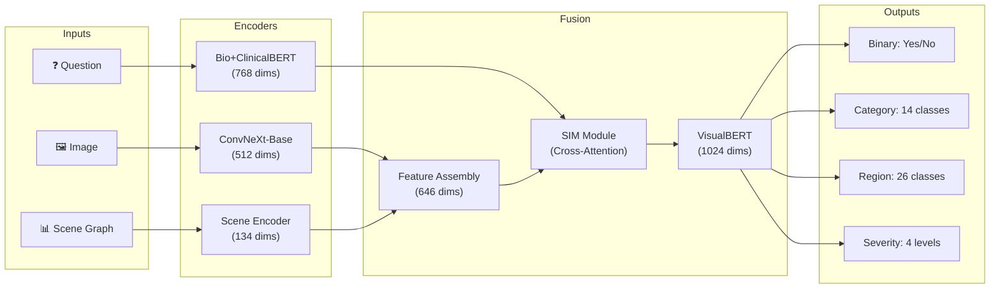
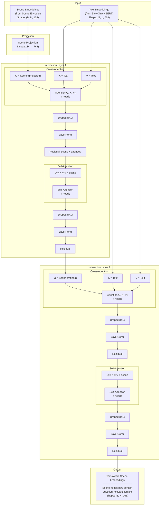
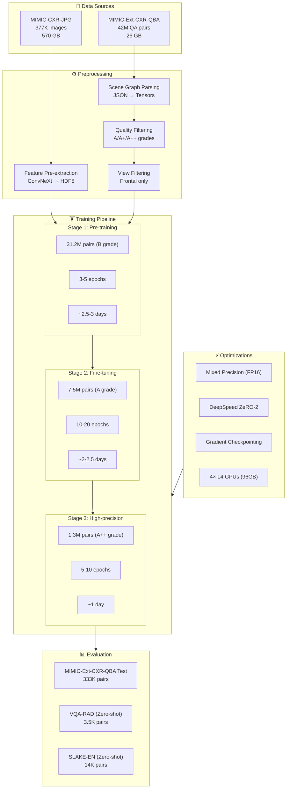
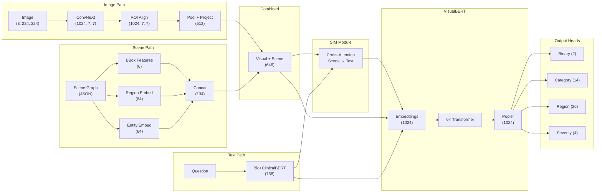
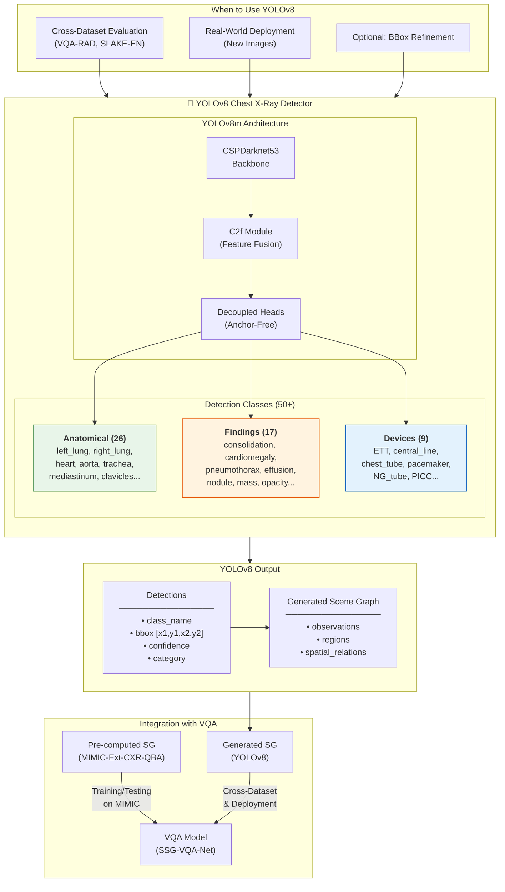
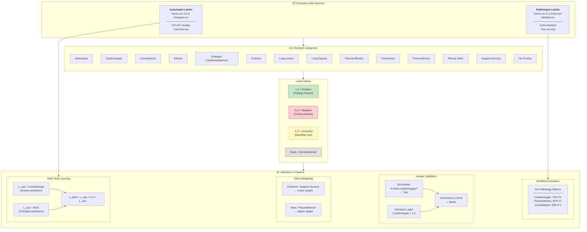
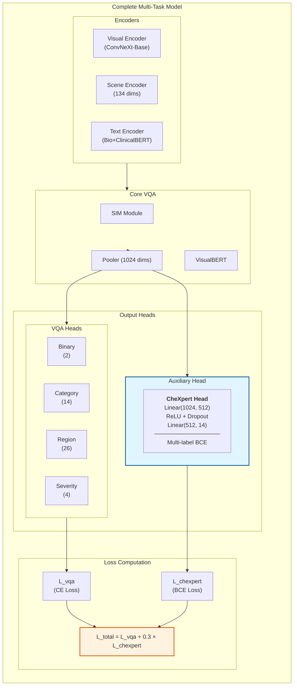
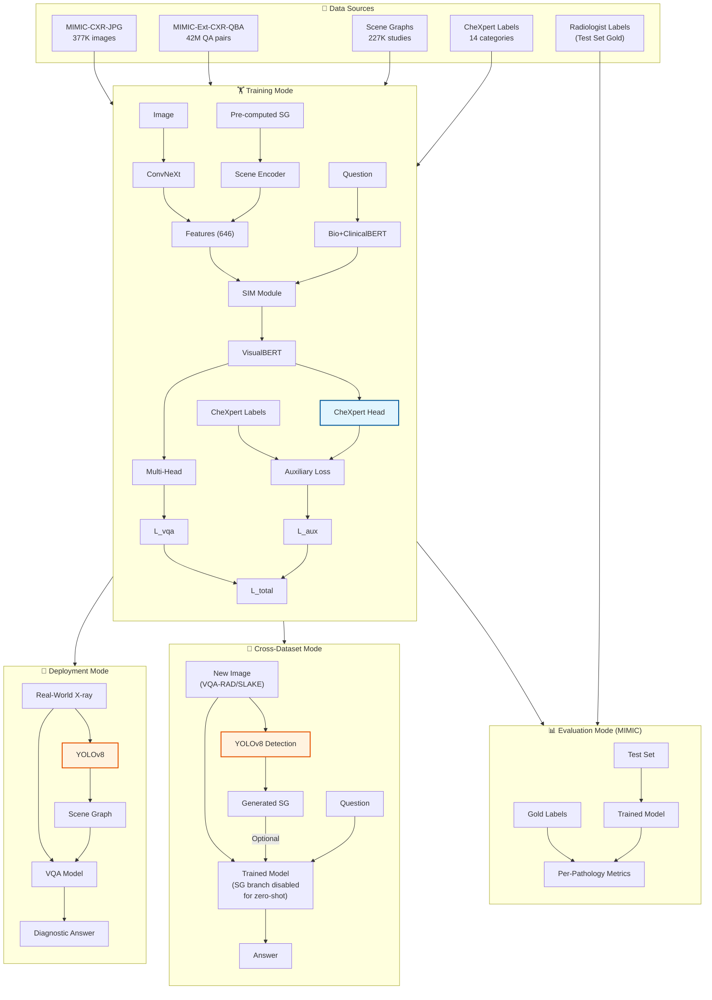

# MIMIC-CXR VQA Architecture Diagram

## Complete System Architecture with All Methodology Innovations

```mermaid
flowchart TB
    subgraph INPUT["📥 INPUT LAYER"]
        IMG["🖼️ Chest X-Ray Image<br/>(JPG from MIMIC-CXR-JPG)"]
        SG["📊 Scene Graph JSON<br/>(from MIMIC-Ext-CXR-QBA)"]
        Q["❓ Question Text<br/>(from QA pairs)"]
    end

    subgraph VISUAL["🔬 VISUAL ENCODER (ConvNeXt-Base)"]
        direction TB
        CONV["<b>ConvNeXt-Base</b><br/>────────────────<br/>• Depthwise Separable Conv<br/>• Inverted Bottlenecks<br/>• 7×7 Kernels<br/>• Layer Normalization<br/>• GELU Activation<br/>────────────────<br/>Pretrained: fb_in22k_ft_in1k"]
        
        FEAT_MAP["Feature Maps<br/>(B, 1024, H/32, W/32)"]
        
        subgraph ROI["ROI Processing"]
            ROI_ALIGN["<b>ROI Align</b><br/>────────────────<br/>• Output: 7×7<br/>• Scale: 1/32<br/>• Sampling: 2"]
            ROI_POOL["Adaptive Avg Pool<br/>(1×1)"]
        end
        
        PROJ_V["Linear Projection<br/>1024 → 512 dims"]
        
        CONV --> FEAT_MAP
        FEAT_MAP --> ROI_ALIGN
        ROI_ALIGN --> ROI_POOL
        ROI_POOL --> PROJ_V
    end

    subgraph SCENE["🌐 SCENE GRAPH ENCODER (Expanded 134 dims)"]
        direction TB
        
        subgraph PARSE["Scene Graph Parser"]
            OBS["Observations<br/>• name<br/>• regions<br/>• obs_entities<br/>• positiveness<br/>• localization"]
            REG["Regions<br/>• 310 anatomical regions<br/>• bounding boxes"]
        end
        
        subgraph BBOX["Bounding Box Features (6 dims)"]
            COORDS["Normalized Coords<br/>(x1, y1, x2, y2) → 4 dims"]
            AREA["Area → 1 dim"]
            ASPECT["Aspect Ratio → 1 dim"]
        end
        
        subgraph EMB["Learned Embeddings (128 dims)"]
            REG_EMB["<b>Region Embedding</b><br/>────────────────<br/>nn.Embedding(310, 64)<br/>────────────────<br/>lungs, heart, mediastinum,<br/>pleura, ribs, spine,<br/>left_lung, right_lung..."]
            
            ENT_EMB["<b>Entity Embedding</b><br/>────────────────<br/>nn.Embedding(237, 64)<br/>────────────────<br/>consolidation, cardiomegaly,<br/>pneumothorax, edema,<br/>pleural_effusion, nodule..."]
        end
        
        AGG_R["Region Aggregator<br/>Mean Pool + LayerNorm + GELU"]
        AGG_E["Entity Aggregator<br/>Mean Pool + LayerNorm + GELU"]
        
        OBS --> COORDS
        OBS --> REG_EMB
        OBS --> ENT_EMB
        REG --> COORDS
        COORDS --> AREA
        AREA --> ASPECT
        REG_EMB --> AGG_R
        ENT_EMB --> AGG_E
    end

    subgraph TEXT["📝 TEXT ENCODER (Bio+ClinicalBERT)"]
        direction TB
        TOK["<b>Bio+ClinicalBERT Tokenizer</b><br/>────────────────<br/>emilyalsentzer/Bio_ClinicalBERT<br/>────────────────<br/>• Medical terminology<br/>• Clinical abbreviations<br/>• Domain-specific vocab"]
        
        BERT_EMB["BERT Embeddings<br/>• Word Embeddings<br/>• Position Embeddings<br/>• Token Type Embeddings"]
        
        TOK --> BERT_EMB
    end

    subgraph CONCAT["🔗 FEATURE ASSEMBLY"]
        SCENE_FEAT["Scene Features<br/>(N, 134 dims)<br/>────────────────<br/>bbox: 6 dims<br/>region_emb: 64 dims<br/>entity_emb: 64 dims"]
        
        VIS_FEAT["Visual Features<br/>(N, 512 dims)<br/>────────────────<br/>ConvNeXt ROI features"]
        
        COMBINED["Combined Features<br/>(N, 646 dims)<br/>────────────────<br/>scene: 134 dims<br/>visual: 512 dims"]
        
        SCENE_FEAT --> COMBINED
        VIS_FEAT --> COMBINED
    end

    subgraph SIM["⚡ SCENE-EMBEDDED INTERACTION MODULE (SIM)"]
        direction TB
        
        subgraph CROSS1["Cross-Attention Layer 1"]
            CA1["Scene queries Text<br/>(K=Text, V=Text, Q=Scene)"]
            SA1["Self-Attention on Scene"]
            LN1["LayerNorm + Residual"]
        end
        
        subgraph CROSS2["Cross-Attention Layer 2"]
            CA2["Scene queries Text<br/>(K=Text, V=Text, Q=Scene)"]
            SA2["Self-Attention on Scene"]
            LN2["LayerNorm + Residual"]
        end
        
        CA1 --> SA1 --> LN1 --> CA2 --> SA2 --> LN2
        
        SIM_OUT["Text-Aware Scene Embeddings<br/>(Question-Relevant Regions Highlighted)"]
        LN2 --> SIM_OUT
    end

    subgraph VB["🤖 VISUALBERT ENCODER"]
        direction TB
        
        VB_EMB["<b>VisualBert Embeddings</b><br/>────────────────<br/>• Word Embeddings<br/>• Position Embeddings<br/>• Visual Projection (646→1024)<br/>• Visual Position Embeddings"]
        
        subgraph LAYERS["Transformer Layers (×6)"]
            SELF_ATT["Multi-Head Self-Attention<br/>(8 heads)"]
            FFN["Feed-Forward Network<br/>1024 → 4096 → 1024"]
            LN_VB["LayerNorm + Residual"]
        end
        
        POOLER["Pooler<br/>(CLS token → 1024 dims)"]
        
        VB_EMB --> LAYERS --> POOLER
    end

    subgraph HEADS["🎯 MULTI-HEAD ANSWER MODULE"]
        direction TB
        
        POOL_OUT["Pooled Output<br/>(1024 dims)"]
        
        subgraph HEAD1["Binary Head"]
            BH["Linear(1024, 256)<br/>ReLU + Dropout<br/>Linear(256, 2)"]
            BH_OUT["Yes / No"]
        end
        
        subgraph HEAD2["Category Head"]
            CH["Linear(1024, 512)<br/>ReLU + Dropout<br/>Linear(512, 14)"]
            CH_OUT["14 CheXpert Classes<br/>────────────────<br/>Atelectasis, Cardiomegaly,<br/>Consolidation, Edema,<br/>Pleural Effusion, Pneumonia,<br/>Pneumothorax, ..."]
        end
        
        subgraph HEAD3["Region Head"]
            RH["Linear(1024, 512)<br/>ReLU + Dropout<br/>Linear(512, 26)"]
            RH_OUT["26 Anatomical Regions<br/>────────────────<br/>left_lung, right_lung,<br/>heart, mediastinum,<br/>pleura, diaphragm, ..."]
        end
        
        subgraph HEAD4["Severity Head"]
            SH["Linear(1024, 128)<br/>ReLU + Dropout<br/>Linear(128, 4)"]
            SH_OUT["None / Mild /<br/>Moderate / Severe"]
        end
        
        POOL_OUT --> BH --> BH_OUT
        POOL_OUT --> CH --> CH_OUT
        POOL_OUT --> RH --> RH_OUT
        POOL_OUT --> SH --> SH_OUT
    end

    subgraph ROUTER["🔀 QUESTION-TYPE ROUTER"]
        QT["Question Type Detection<br/>────────────────<br/>is_abnormal → Binary<br/>has_finding → Binary + Category<br/>where_is → Region<br/>how_severe → Severity<br/>describe → Category + Text"]
    end

    subgraph OUTPUT["📤 OUTPUT"]
        ANS["Final Answer<br/>────────────────<br/>Binary: Yes/No<br/>Category: Finding name<br/>Region: Location<br/>Severity: Level"]
    end

    %% Main Flow Connections
    IMG --> CONV
    SG --> PARSE
    Q --> TOK

    PROJ_V --> VIS_FEAT
    ASPECT --> SCENE_FEAT
    AGG_R --> SCENE_FEAT
    AGG_E --> SCENE_FEAT

    COMBINED --> SIM
    BERT_EMB --> SIM
    
    SIM_OUT --> VB_EMB
    COMBINED --> VB_EMB
    BERT_EMB --> VB_EMB
    
    POOLER --> POOL_OUT
    
    Q --> QT
    QT -.-> HEAD1
    QT -.-> HEAD2
    QT -.-> HEAD3
    QT -.-> HEAD4
    
    BH_OUT --> ANS
    CH_OUT --> ANS
    RH_OUT --> ANS
    SH_OUT --> ANS

    %% Styling
    classDef input fill:#e1f5fe,stroke:#01579b,stroke-width:2px
    classDef visual fill:#fff3e0,stroke:#e65100,stroke-width:2px
    classDef scene fill:#e8f5e9,stroke:#2e7d32,stroke-width:2px
    classDef text fill:#fce4ec,stroke:#c2185b,stroke-width:2px
    classDef sim fill:#f3e5f5,stroke:#7b1fa2,stroke-width:2px
    classDef vbert fill:#e8eaf6,stroke:#3f51b5,stroke-width:2px
    classDef heads fill:#fff8e1,stroke:#f57f17,stroke-width:2px
    classDef output fill:#e0f2f1,stroke:#00695c,stroke-width:2px

    class IMG,SG,Q input
    class CONV,FEAT_MAP,ROI_ALIGN,ROI_POOL,PROJ_V visual
    class OBS,REG,COORDS,AREA,ASPECT,REG_EMB,ENT_EMB,AGG_R,AGG_E scene
    class TOK,BERT_EMB text
    class CA1,SA1,LN1,CA2,SA2,LN2,SIM_OUT sim
    class VB_EMB,SELF_ATT,FFN,LN_VB,POOLER vbert
    class BH,CH,RH,SH,BH_OUT,CH_OUT,RH_OUT,SH_OUT heads
    class ANS output
```



---

## Simplified Data Flow Diagram



---

## Scene-Embedded Interaction Module (SIM) Detail



---

## Training Pipeline Overview



---

## Feature Dimension Flow



---

## Innovations Summary Table

| Component | Original SSG-VQA | **New MIMIC-CXR VQA** | Improvement |
|-----------|------------------|----------------------|-------------|
| **Visual Backbone** | ResNet18 | **ConvNeXt-Base** | +4-7% accuracy |
| **Object Detection** | YOLOv5 | **Pre-computed (YOLOv8-level)** | +3.5-5.8% mAP |
| **Text Encoder** | Generic BERT | **Bio+ClinicalBERT** | +2.8-4.5% accuracy |
| **Scene Features** | 18 dims (one-hot) | **134 dims (learned embeddings)** | 310 regions, 237 entities |
| **Visual Features** | 512 dims | **512 dims (upgraded backbone)** | Better subtle abnormality detection |
| **Total Features** | 530 dims | **646 dims** | +22% richer representation |
| **Answer Heads** | Single (51 classes) | **Multi-head (Binary + Category + Region + Severity)** | Handles all answer types |
| **Training** | Standard FP32 | **FP16 + DeepSpeed ZeRO-2** | 1.7× faster |

---

## YOLOv8 Detection Module (Cross-Dataset & Inference)



### YOLOv8 Performance Comparison

| Metric | YOLOv5 (Original) | **YOLOv8 (Upgraded)** | Improvement |
|--------|-------------------|----------------------|-------------|
| **Precision (Medical)** | ~85% | **Up to 99.17%** | +14.17% |
| **Sensitivity (Medical)** | ~80% | **Up to 97.5%** | +17.5% |
| **Lung Cancer Detection** | ~75% | **90.32%** | +15.32% |
| **Anatomical Structures mAP** | - | **+3.5-5.8%** | Expected |
| **Pathology Detection mAP** | - | **+6.2-9.4%** | Expected |

---

## CheXpert Label Integration (Multi-Task Learning)



### Multi-Task Architecture with CheXpert



---

## Complete Pipeline with All Components



---

## File Structure for Implementation

```
mimic_cxr_vqa/
├── models/
│   ├── convnext_encoder.py      # ConvNeXt-Base visual encoder
│   ├── scene_graph_encoder.py   # Expanded 134-dim scene encoder
│   ├── sim_module.py            # Scene-Embedded Interaction Module
│   ├── visualbert_mimic.py      # Modified VisualBERT (646 dims)
│   ├── multi_head_answer.py     # Multi-head answer module
│   ├── chexpert_head.py         # Auxiliary CheXpert classifier (NEW)
│   ├── yolov8_detector.py       # YOLOv8 for cross-dataset (NEW)
│   └── mimic_vqa_model.py       # Complete model assembly
├── data/
│   ├── dataloader.py            # MIMIC-CXR-QBA dataloader
│   ├── scene_graph_parser.py    # JSON scene graph parser
│   ├── chexpert_loader.py       # CheXpert label loader (NEW)
│   ├── feature_extractor.py     # Pre-extraction utilities
│   └── collate_fn.py            # Batch collation
├── training/
│   ├── train.py                 # Main training script
│   ├── trainer.py               # Training loop with DeepSpeed
│   ├── loss.py                  # Multi-head + CheXpert loss (UPDATED)
│   └── metrics.py               # Evaluation metrics
├── configs/
│   ├── model_config.yaml        # Model hyperparameters
│   ├── train_config.yaml        # Training settings
│   ├── chexpert_config.yaml     # CheXpert integration config (NEW)
│   └── deepspeed_config.json    # DeepSpeed ZeRO-2 config
├── detection/
│   ├── yolov8_train.py          # YOLOv8 fine-tuning script (NEW)
│   ├── convert_sg_to_yolo.py    # Convert SG bboxes to YOLO format (NEW)
│   └── cxr_detection.yaml       # YOLOv8 dataset config (NEW)
└── scripts/
    ├── preprocess_features.py   # Feature pre-extraction
    ├── evaluate.py              # Evaluation script
    ├── evaluate_per_pathology.py # Per-pathology metrics (NEW)
    └── inference.py             # Single-sample inference
```

