# MIMIC-CXR VQA Architecture Diagram

## Complete System Architecture with All Methodology Innovations

```mermaid
flowchart TB
    subgraph INPUT["📥 INPUT LAYER"]
        IMG["🖼️ Chest X-Ray Image<br/>(JPG from MIMIC-CXR-JPG)"]
        SG["📊 Scene Graph JSON<br/>(from MIMIC-Ext-CXR-QBA)"]
        Q["❓ Question Text<br/>(from QA pairs)"]
    end

    subgraph VISUAL["🔬 VISUAL ENCODER (ConvNeXt-Base)"]
        direction TB
        CONV["<b>ConvNeXt-Base</b><br/>────────────────<br/>• Depthwise Separable Conv<br/>• Inverted Bottlenecks<br/>• 7×7 Kernels<br/>• Layer Normalization<br/>• GELU Activation<br/>────────────────<br/>Pretrained: fb_in22k_ft_in1k"]
        
        FEAT_MAP["Feature Maps<br/>(B, 1024, H/32, W/32)"]
        
        subgraph ROI["ROI Processing"]
            ROI_ALIGN["<b>ROI Align</b><br/>────────────────<br/>• Output: 7×7<br/>• Scale: 1/32<br/>• Sampling: 2"]
            ROI_POOL["Adaptive Avg Pool<br/>(1×1)"]
        end
        
        PROJ_V["Linear Projection<br/>1024 → 512 dims"]
        
        CONV --> FEAT_MAP
        FEAT_MAP --> ROI_ALIGN
        ROI_ALIGN --> ROI_POOL
        ROI_POOL --> PROJ_V
    end

    subgraph SCENE["🌐 SCENE GRAPH ENCODER (Expanded 134 dims)"]
        direction TB
        
        subgraph PARSE["Scene Graph Parser"]
            OBS["Observations<br/>• name<br/>• regions<br/>• obs_entities<br/>• positiveness<br/>• localization"]
            REG["Regions<br/>• 310 anatomical regions<br/>• bounding boxes"]
        end
        
        subgraph BBOX["Bounding Box Features (6 dims)"]
            COORDS["Normalized Coords<br/>(x1, y1, x2, y2) → 4 dims"]
            AREA["Area → 1 dim"]
            ASPECT["Aspect Ratio → 1 dim"]
        end
        
        subgraph EMB["Learned Embeddings (128 dims)"]
            REG_EMB["<b>Region Embedding</b><br/>────────────────<br/>nn.Embedding(310, 64)<br/>────────────────<br/>lungs, heart, mediastinum,<br/>pleura, ribs, spine,<br/>left_lung, right_lung..."]
            
            ENT_EMB["<b>Entity Embedding</b><br/>────────────────<br/>nn.Embedding(237, 64)<br/>────────────────<br/>consolidation, cardiomegaly,<br/>pneumothorax, edema,<br/>pleural_effusion, nodule..."]
        end
        
        AGG_R["Region Aggregator<br/>Mean Pool + LayerNorm + GELU"]
        AGG_E["Entity Aggregator<br/>Mean Pool + LayerNorm + GELU"]
        
        OBS --> COORDS
        OBS --> REG_EMB
        OBS --> ENT_EMB
        REG --> COORDS
        COORDS --> AREA
        AREA --> ASPECT
        REG_EMB --> AGG_R
        ENT_EMB --> AGG_E
    end

    subgraph TEXT["📝 TEXT ENCODER (Bio+ClinicalBERT)"]
        direction TB
        TOK["<b>Bio+ClinicalBERT Tokenizer</b><br/>────────────────<br/>emilyalsentzer/Bio_ClinicalBERT<br/>────────────────<br/>• Medical terminology<br/>• Clinical abbreviations<br/>• Domain-specific vocab"]
        
        BERT_EMB["BERT Embeddings<br/>• Word Embeddings<br/>• Position Embeddings<br/>• Token Type Embeddings"]
        
        TOK --> BERT_EMB
    end

    subgraph CONCAT["🔗 FEATURE ASSEMBLY"]
        SCENE_FEAT["Scene Features<br/>(N, 134 dims)<br/>────────────────<br/>bbox: 6 dims<br/>region_emb: 64 dims<br/>entity_emb: 64 dims"]
        
        VIS_FEAT["Visual Features<br/>(N, 512 dims)<br/>────────────────<br/>ConvNeXt ROI features"]
        
        COMBINED["Combined Features<br/>(N, 646 dims)<br/>────────────────<br/>scene: 134 dims<br/>visual: 512 dims"]
        
        SCENE_FEAT --> COMBINED
        VIS_FEAT --> COMBINED
    end

    subgraph SIM["⚡ SCENE-EMBEDDED INTERACTION MODULE (SIM)"]
        direction TB
        
        subgraph CROSS1["Cross-Attention Layer 1"]
            CA1["Scene queries Text<br/>(K=Text, V=Text, Q=Scene)"]
            SA1["Self-Attention on Scene"]
            LN1["LayerNorm + Residual"]
        end
        
        subgraph CROSS2["Cross-Attention Layer 2"]
            CA2["Scene queries Text<br/>(K=Text, V=Text, Q=Scene)"]
            SA2["Self-Attention on Scene"]
            LN2["LayerNorm + Residual"]
        end
        
        CA1 --> SA1 --> LN1 --> CA2 --> SA2 --> LN2
        
        SIM_OUT["Text-Aware Scene Embeddings<br/>(Question-Relevant Regions Highlighted)"]
        LN2 --> SIM_OUT
    end

    subgraph VB["🤖 VISUALBERT ENCODER"]
        direction TB
        
        VB_EMB["<b>VisualBert Embeddings</b><br/>────────────────<br/>• Word Embeddings<br/>• Position Embeddings<br/>• Visual Projection (646→1024)<br/>• Visual Position Embeddings"]
        
        subgraph LAYERS["Transformer Layers (×6)"]
            SELF_ATT["Multi-Head Self-Attention<br/>(8 heads)"]
            FFN["Feed-Forward Network<br/>1024 → 4096 → 1024"]
            LN_VB["LayerNorm + Residual"]
        end
        
        POOLER["Pooler<br/>(CLS token → 1024 dims)"]
        
        VB_EMB --> LAYERS --> POOLER
    end

    subgraph HEADS["🎯 MULTI-HEAD ANSWER MODULE"]
        direction TB
        
        POOL_OUT["Pooled Output<br/>(1024 dims)"]
        
        subgraph HEAD1["Binary Head"]
            BH["Linear(1024, 256)<br/>ReLU + Dropout<br/>Linear(256, 2)"]
            BH_OUT["Yes / No"]
        end
        
        subgraph HEAD2["Category Head"]
            CH["Linear(1024, 512)<br/>ReLU + Dropout<br/>Linear(512, 14)"]
            CH_OUT["14 CheXpert Classes<br/>────────────────<br/>Atelectasis, Cardiomegaly,<br/>Consolidation, Edema,<br/>Pleural Effusion, Pneumonia,<br/>Pneumothorax, ..."]
        end
        
        subgraph HEAD3["Region Head"]
            RH["Linear(1024, 512)<br/>ReLU + Dropout<br/>Linear(512, 26)"]
            RH_OUT["26 Anatomical Regions<br/>────────────────<br/>left_lung, right_lung,<br/>heart, mediastinum,<br/>pleura, diaphragm, ..."]
        end
        
        subgraph HEAD4["Severity Head"]
            SH["Linear(1024, 128)<br/>ReLU + Dropout<br/>Linear(128, 4)"]
            SH_OUT["None / Mild /<br/>Moderate / Severe"]
        end
        
        POOL_OUT --> BH --> BH_OUT
        POOL_OUT --> CH --> CH_OUT
        POOL_OUT --> RH --> RH_OUT
        POOL_OUT --> SH --> SH_OUT
    end

    subgraph ROUTER["🔀 QUESTION-TYPE ROUTER"]
        QT["Question Type Detection<br/>────────────────<br/>is_abnormal → Binary<br/>has_finding → Binary + Category<br/>where_is → Region<br/>how_severe → Severity<br/>describe → Category + Text"]
    end

    subgraph OUTPUT["📤 OUTPUT"]
        ANS["Final Answer<br/>────────────────<br/>Binary: Yes/No<br/>Category: Finding name<br/>Region: Location<br/>Severity: Level"]
    end

    %% Main Flow Connections
    IMG --> CONV
    SG --> PARSE
    Q --> TOK

    PROJ_V --> VIS_FEAT
    ASPECT --> SCENE_FEAT
    AGG_R --> SCENE_FEAT
    AGG_E --> SCENE_FEAT

    COMBINED --> SIM
    BERT_EMB --> SIM
    
    SIM_OUT --> VB_EMB
    COMBINED --> VB_EMB
    BERT_EMB --> VB_EMB
    
    POOLER --> POOL_OUT
    
    Q --> QT
    QT -.-> HEAD1
    QT -.-> HEAD2
    QT -.-> HEAD3
    QT -.-> HEAD4
    
    BH_OUT --> ANS
    CH_OUT --> ANS
    RH_OUT --> ANS
    SH_OUT --> ANS

    %% Styling
    classDef input fill:#e1f5fe,stroke:#01579b,stroke-width:2px
    classDef visual fill:#fff3e0,stroke:#e65100,stroke-width:2px
    classDef scene fill:#e8f5e9,stroke:#2e7d32,stroke-width:2px
    classDef text fill:#fce4ec,stroke:#c2185b,stroke-width:2px
    classDef sim fill:#f3e5f5,stroke:#7b1fa2,stroke-width:2px
    classDef vbert fill:#e8eaf6,stroke:#3f51b5,stroke-width:2px
    classDef heads fill:#fff8e1,stroke:#f57f17,stroke-width:2px
    classDef output fill:#e0f2f1,stroke:#00695c,stroke-width:2px

    class IMG,SG,Q input
    class CONV,FEAT_MAP,ROI_ALIGN,ROI_POOL,PROJ_V visual
    class OBS,REG,COORDS,AREA,ASPECT,REG_EMB,ENT_EMB,AGG_R,AGG_E scene
    class TOK,BERT_EMB text
    class CA1,SA1,LN1,CA2,SA2,LN2,SIM_OUT sim
    class VB_EMB,SELF_ATT,FFN,LN_VB,POOLER vbert
    class BH,CH,RH,SH,BH_OUT,CH_OUT,RH_OUT,SH_OUT heads
    class ANS output
```



---

## Simplified Data Flow Diagram


---

## Scene-Embedded Interaction Module (SIM) Detail

```mermaid
flowchart TB
    subgraph Input
        TEXT_IN["Text Embeddings<br/>(from Bio+ClinicalBERT)<br/>Shape: (B, L, 768)"]
        SCENE_IN["Scene Embeddings<br/>(from Scene Encoder)<br/>Shape: (B, N, 134)"]
    end

    subgraph Projection
        PROJ_S["Scene Projection<br/>Linear(134 → 768)"]
        SCENE_IN --> PROJ_S
    end

    subgraph Layer1["Interaction Layer 1"]
        direction TB
        
        subgraph CA_1["Cross-Attention"]
            Q1["Q = Scene (projected)"]
            K1["K = Text"]
            V1["V = Text"]
            ATT1["Attention(Q, K, V)<br/>4 heads"]
        end
        
        DROP1["Dropout(0.1)"]
        LN1_["LayerNorm"]
        RES1["Residual: scene + attended"]
        
        subgraph SA_1["Self-Attention"]
            QKV1["Q = K = V = scene"]
            SATT1["Self-Attention<br/>4 heads"]
        end
        
        DROP1_["Dropout(0.1)"]
        LN1__["LayerNorm"]
        RES1_["Residual"]
    end

    subgraph Layer2["Interaction Layer 2"]
        direction TB
        
        subgraph CA_2["Cross-Attention"]
            Q2["Q = Scene (refined)"]
            K2["K = Text"]
            V2["V = Text"]
            ATT2["Attention(Q, K, V)<br/>4 heads"]
        end
        
        DROP2["Dropout(0.1)"]
        LN2_["LayerNorm"]
        RES2["Residual"]
        
        subgraph SA_2["Self-Attention"]
            QKV2["Q = K = V = scene"]
            SATT2["Self-Attention<br/>4 heads"]
        end
        
        DROP2_["Dropout(0.1)"]
        LN2__["LayerNorm"]
        RES2_["Residual"]
    end

    subgraph Output
        OUT["Text-Aware Scene Embeddings<br/>────────────────<br/>Scene nodes now contain<br/>question-relevant context<br/>Shape: (B, N, 768)"]
    end

    PROJ_S --> Q1
    TEXT_IN --> K1
    TEXT_IN --> V1
    Q1 & K1 & V1 --> ATT1
    ATT1 --> DROP1 --> LN1_ --> RES1
    RES1 --> QKV1 --> SATT1
    SATT1 --> DROP1_ --> LN1__ --> RES1_
    
    RES1_ --> Q2
    TEXT_IN --> K2
    TEXT_IN --> V2
    Q2 & K2 & V2 --> ATT2
    ATT2 --> DROP2 --> LN2_ --> RES2
    RES2 --> QKV2 --> SATT2
    SATT2 --> DROP2_ --> LN2__ --> RES2_
    
    RES2_ --> OUT
```



---

## Training Pipeline Overview

```mermaid
flowchart TB
    subgraph Data["📁 Data Sources"]
        D1["MIMIC-CXR-JPG<br/>377K images<br/>570 GB"]
        D2["MIMIC-Ext-CXR-QBA<br/>42M QA pairs<br/>26 GB"]
    end

    subgraph Preprocess["⚙️ Preprocessing"]
        P1["Feature Pre-extraction<br/>ConvNeXt → HDF5"]
        P2["Scene Graph Parsing<br/>JSON → Tensors"]
        P3["Quality Filtering<br/>A/A+/A++ grades"]
        P4["View Filtering<br/>Frontal only"]
    end

    subgraph Training["🏋️ Training Pipeline"]
        subgraph Stage1["Stage 1: Pre-training"]
            S1_D["31.2M pairs (B grade)"]
            S1_E["3-5 epochs"]
            S1_T["~2.5-3 days"]
        end
        
        subgraph Stage2["Stage 2: Fine-tuning"]
            S2_D["7.5M pairs (A grade)"]
            S2_E["10-20 epochs"]
            S2_T["~2-2.5 days"]
        end
        
        subgraph Stage3["Stage 3: High-precision"]
            S3_D["1.3M pairs (A++ grade)"]
            S3_E["5-10 epochs"]
            S3_T["~1 day"]
        end
    end

    subgraph Optim["⚡ Optimizations"]
        O1["Mixed Precision (FP16)"]
        O2["DeepSpeed ZeRO-2"]
        O3["Gradient Checkpointing"]
        O4["4× L4 GPUs (96GB)"]
    end

    subgraph Eval["📊 Evaluation"]
        E1["MIMIC-Ext-CXR-QBA Test<br/>333K pairs"]
        E2["VQA-RAD (Zero-shot)<br/>3.5K pairs"]
        E3["SLAKE-EN (Zero-shot)<br/>14K pairs"]
    end

    D1 --> P1
    D2 --> P2
    P2 --> P3 --> P4
    
    P1 & P4 --> Stage1
    Stage1 --> Stage2 --> Stage3
    
    Optim --> Training
    
    Stage3 --> Eval
```



---

## Feature Dimension Flow


---

## Innovations Summary Table

| Component | Original SSG-VQA | **New MIMIC-CXR VQA** | Improvement |
|-----------|------------------|----------------------|-------------|
| **Visual Backbone** | ResNet18 | **ConvNeXt-Base** | +4-7% accuracy |
| **Object Detection** | YOLOv5 | **Pre-computed (YOLOv8-level)** | +3.5-5.8% mAP |
| **Text Encoder** | Generic BERT | **Bio+ClinicalBERT** | +2.8-4.5% accuracy |
| **Scene Features** | 18 dims (one-hot) | **134 dims (learned embeddings)** | 310 regions, 237 entities |
| **Visual Features** | 512 dims | **512 dims (upgraded backbone)** | Better subtle abnormality detection |
| **Total Features** | 530 dims | **646 dims** | +22% richer representation |
| **Answer Heads** | Single (51 classes) | **Multi-head (Binary + Category + Region + Severity)** | Handles all answer types |
| **Training** | Standard FP32 | **FP16 + DeepSpeed ZeRO-2** | 1.7× faster |

---

## YOLOv8 Detection Module (Cross-Dataset & Inference)

```mermaid
flowchart TB
    subgraph WHEN["When to Use YOLOv8"]
        W1["Cross-Dataset Evaluation<br/>(VQA-RAD, SLAKE-EN)"]
        W2["Real-World Deployment<br/>(New Images)"]
        W3["Optional: BBox Refinement"]
    end

    subgraph YOLO["🎯 YOLOv8 Chest X-Ray Detector"]
        direction TB
        
        subgraph MODEL["YOLOv8m Architecture"]
            BACKBONE_Y["CSPDarknet53<br/>Backbone"]
            NECK_Y["C2f Module<br/>(Feature Fusion)"]
            HEAD_Y["Decoupled Heads<br/>(Anchor-Free)"]
        end
        
        subgraph CLASSES["Detection Classes (50+)"]
            ANAT["<b>Anatomical (26)</b><br/>left_lung, right_lung,<br/>heart, aorta, trachea,<br/>mediastinum, clavicles..."]
            FIND["<b>Findings (17)</b><br/>consolidation, cardiomegaly,<br/>pneumothorax, effusion,<br/>nodule, mass, opacity..."]
            DEV["<b>Devices (9)</b><br/>ETT, central_line,<br/>chest_tube, pacemaker,<br/>NG_tube, PICC..."]
        end
        
        BACKBONE_Y --> NECK_Y --> HEAD_Y
        HEAD_Y --> ANAT & FIND & DEV
    end

    subgraph OUTPUT_Y["YOLOv8 Output"]
        DET["Detections<br/>────────────────<br/>• class_name<br/>• bbox [x1,y1,x2,y2]<br/>• confidence<br/>• category"]
        
        SG_GEN["Generated Scene Graph<br/>────────────────<br/>• observations<br/>• regions<br/>• spatial_relations"]
        
        DET --> SG_GEN
    end

    subgraph PIPELINE["Integration with VQA"]
        PRE["Pre-computed SG<br/>(MIMIC-Ext-CXR-QBA)"]
        GEN["Generated SG<br/>(YOLOv8)"]
        VQA["VQA Model<br/>(SSG-VQA-Net)"]
        
        PRE -->|"Training/Testing<br/>on MIMIC"| VQA
        GEN -->|"Cross-Dataset<br/>& Deployment"| VQA
    end

    W1 & W2 & W3 --> YOLO
    YOLO --> OUTPUT_Y --> GEN
    
    style ANAT fill:#e8f5e9,stroke:#2e7d32
    style FIND fill:#fff3e0,stroke:#e65100
    style DEV fill:#e3f2fd,stroke:#1565c0
```



### YOLOv8 Performance Comparison

| Metric | YOLOv5 (Original) | **YOLOv8 (Upgraded)** | Improvement |
|--------|-------------------|----------------------|-------------|
| **Precision (Medical)** | ~85% | **Up to 99.17%** | +14.17% |
| **Sensitivity (Medical)** | ~80% | **Up to 97.5%** | +17.5% |
| **Lung Cancer Detection** | ~75% | **90.32%** | +15.32% |
| **Anatomical Structures mAP** | - | **+3.5-5.8%** | Expected |
| **Pathology Detection mAP** | - | **+6.2-9.4%** | Expected |

---

## CheXpert Label Integration (Multi-Task Learning)

```mermaid
flowchart TB
    subgraph LABELS["📋 CheXpert Label Sources"]
        AUTO["<b>Automated Labels</b><br/>mimic-cxr-2.0.0-chexpert.csv<br/>────────────────<br/>227,827 studies<br/>Train/Val use"]
        
        GOLD["<b>Radiologist Labels</b><br/>mimic-cxr-2.1.0-test-set-labeled.csv<br/>────────────────<br/>Gold standard<br/>Test set only"]
    end

    subgraph CATS["14 CheXpert Categories"]
        direction TB
        C1["Atelectasis"]
        C2["Cardiomegaly"]
        C3["Consolidation"]
        C4["Edema"]
        C5["Enlarged Cardiomediastinum"]
        C6["Fracture"]
        C7["Lung Lesion"]
        C8["Lung Opacity"]
        C9["Pleural Effusion"]
        C10["Pneumonia"]
        C11["Pneumothorax"]
        C12["Pleural Other"]
        C13["Support Devices"]
        C14["No Finding"]
    end

    subgraph VALUES["Label Values"]
        V1["1.0 = Positive<br/>(Finding Present)"]
        V2["0.0 = Negative<br/>(Finding Absent)"]
        V3["-1.0 = Uncertain<br/>(May/May Not)"]
        V4["blank = Not Mentioned"]
    end

    subgraph USE["📊 Utilization in Pipeline"]
        direction TB
        
        subgraph MULTI["Multi-Task Learning"]
            VQA_LOSS["L_vqa = CrossEntropy<br/>(answer prediction)"]
            AUX_LOSS["L_aux = BCE<br/>(CheXpert prediction)"]
            TOTAL["L_total = L_vqa + 0.3 × L_aux"]
            
            VQA_LOSS --> TOTAL
            AUX_LOSS --> TOTAL
        end
        
        subgraph VALID["Answer Validation"]
            QA_ANS["QA Answer:<br/>'Is there cardiomegaly?'<br/>→ 'Yes'"]
            CHEX["CheXpert Label:<br/>Cardiomegaly = 1.0"]
            CHECK["Consistency Check<br/>✓ Match"]
            
            QA_ANS --> CHECK
            CHEX --> CHECK
        end
        
        subgraph STRAT["Stratified Evaluation"]
            PER_PATH["Per-Pathology Metrics<br/>────────────────<br/>Cardiomegaly: 75% F1<br/>Pneumothorax: 82% F1<br/>Consolidation: 68% F1<br/>..."]
        end
        
        subgraph WEIGHT["Class Weighting"]
            COMMON["Common: 'Support Devices'<br/>→ Lower weight"]
            RARE["Rare: 'Pneumothorax'<br/>→ Higher weight"]
        end
    end

    AUTO --> MULTI
    GOLD --> STRAT
    
    LABELS --> CATS --> VALUES --> USE
    
    style V1 fill:#c8e6c9,stroke:#2e7d32
    style V2 fill:#ffcdd2,stroke:#c62828
    style V3 fill:#fff9c4,stroke:#f9a825
    style V4 fill:#e0e0e0,stroke:#616161
```



### Multi-Task Architecture with CheXpert

```mermaid
flowchart TB
    subgraph MODEL["Complete Multi-Task Model"]
        direction TB
        
        subgraph ENC["Encoders"]
            VIS["Visual Encoder<br/>(ConvNeXt-Base)"]
            SCENE["Scene Encoder<br/>(134 dims)"]
            TEXT["Text Encoder<br/>(Bio+ClinicalBERT)"]
        end
        
        subgraph CORE["Core VQA"]
            SIM_M["SIM Module"]
            VB_M["VisualBERT"]
            POOL["Pooler (1024 dims)"]
        end
        
        subgraph HEADS_M["Output Heads"]
            direction LR
            
            subgraph VQA_HEADS["VQA Heads"]
                BIN_H["Binary<br/>(2)"]
                CAT_H["Category<br/>(14)"]
                REG_H["Region<br/>(26)"]
                SEV_H["Severity<br/>(4)"]
            end
            
            subgraph AUX_HEAD["Auxiliary Head"]
                CHEX_H["<b>CheXpert Head</b><br/>Linear(1024, 512)<br/>ReLU + Dropout<br/>Linear(512, 14)<br/>────────────────<br/>Multi-label BCE"]
            end
        end
        
        subgraph LOSS_M["Loss Computation"]
            L_VQA["L_vqa<br/>(CE Loss)"]
            L_CHEX["L_chexpert<br/>(BCE Loss)"]
            L_TOTAL["L_total = L_vqa + 0.3 × L_chexpert"]
            
            L_VQA --> L_TOTAL
            L_CHEX --> L_TOTAL
        end
        
        ENC --> CORE --> POOL
        POOL --> VQA_HEADS
        POOL --> AUX_HEAD
        
        VQA_HEADS --> L_VQA
        AUX_HEAD --> L_CHEX
    end

    style AUX_HEAD fill:#e1f5fe,stroke:#01579b,stroke-width:2px
    style L_TOTAL fill:#fff3e0,stroke:#e65100,stroke-width:2px
```



---

## Complete Pipeline with All Components

```mermaid
flowchart TB
    subgraph DATA["📁 Data Sources"]
        D_IMG["MIMIC-CXR-JPG<br/>377K images"]
        D_QA["MIMIC-Ext-CXR-QBA<br/>42M QA pairs"]
        D_SG["Scene Graphs<br/>227K studies"]
        D_CHEX["CheXpert Labels<br/>14 categories"]
        D_RADIO["Radiologist Labels<br/>(Test Set Gold)"]
    end

    subgraph TRAIN["🏋️ Training Mode"]
        direction TB
        T_IMG["Image"] --> T_CONV["ConvNeXt"]
        T_SG["Pre-computed SG"] --> T_ENC["Scene Encoder"]
        T_Q["Question"] --> T_BERT["Bio+ClinicalBERT"]
        T_CHEX["CheXpert Labels"] --> T_AUX["Auxiliary Loss"]
        
        T_CONV & T_ENC --> T_FEAT["Features (646)"]
        T_FEAT & T_BERT --> T_SIM["SIM Module"]
        T_SIM --> T_VB["VisualBERT"]
        T_VB --> T_HEADS["Multi-Head"]
        T_VB --> T_CHEX_HEAD["CheXpert Head"]
        
        T_HEADS --> T_VQA_LOSS["L_vqa"]
        T_CHEX_HEAD --> T_AUX
        T_AUX --> T_AUX_LOSS["L_aux"]
        T_VQA_LOSS & T_AUX_LOSS --> T_TOTAL["L_total"]
    end

    subgraph EVAL["📊 Evaluation Mode (MIMIC)"]
        direction TB
        E_TEST["Test Set"] --> E_MODEL["Trained Model"]
        E_GOLD["Gold Labels"] --> E_METRICS["Per-Pathology Metrics"]
        E_MODEL --> E_METRICS
    end

    subgraph CROSS["🔄 Cross-Dataset Mode"]
        direction TB
        C_NEW["New Image<br/>(VQA-RAD/SLAKE)"]
        C_YOLO["YOLOv8 Detection"]
        C_GEN_SG["Generated SG"]
        C_Q["Question"]
        C_MODEL["Trained Model<br/>(SG branch disabled<br/>for zero-shot)"]
        C_ANS["Answer"]
        
        C_NEW --> C_YOLO --> C_GEN_SG
        C_NEW --> C_MODEL
        C_GEN_SG -->|"Optional"| C_MODEL
        C_Q --> C_MODEL
        C_MODEL --> C_ANS
    end

    subgraph DEPLOY["🚀 Deployment Mode"]
        direction TB
        DEP_IMG["Real-World X-ray"]
        DEP_YOLO["YOLOv8"]
        DEP_SG["Scene Graph"]
        DEP_MODEL["VQA Model"]
        DEP_ANS["Diagnostic Answer"]
        
        DEP_IMG --> DEP_YOLO --> DEP_SG
        DEP_IMG & DEP_SG --> DEP_MODEL --> DEP_ANS
    end

    D_IMG --> TRAIN
    D_QA --> TRAIN
    D_SG --> TRAIN
    D_CHEX --> TRAIN
    
    TRAIN --> EVAL
    D_RADIO --> EVAL
    
    TRAIN --> CROSS
    TRAIN --> DEPLOY

    style T_CHEX_HEAD fill:#e1f5fe,stroke:#01579b,stroke-width:2px
    style C_YOLO fill:#fff3e0,stroke:#e65100,stroke-width:2px
    style DEP_YOLO fill:#fff3e0,stroke:#e65100,stroke-width:2px
```



---

## File Structure for Implementation

```
mimic_cxr_vqa/
├── models/
│   ├── convnext_encoder.py      # ConvNeXt-Base visual encoder
│   ├── scene_graph_encoder.py   # Expanded 134-dim scene encoder
│   ├── sim_module.py            # Scene-Embedded Interaction Module
│   ├── visualbert_mimic.py      # Modified VisualBERT (646 dims)
│   ├── multi_head_answer.py     # Multi-head answer module
│   ├── chexpert_head.py         # Auxiliary CheXpert classifier (NEW)
│   ├── yolov8_detector.py       # YOLOv8 for cross-dataset (NEW)
│   └── mimic_vqa_model.py       # Complete model assembly
├── data/
│   ├── dataloader.py            # MIMIC-CXR-QBA dataloader
│   ├── scene_graph_parser.py    # JSON scene graph parser
│   ├── chexpert_loader.py       # CheXpert label loader (NEW)
│   ├── feature_extractor.py     # Pre-extraction utilities
│   └── collate_fn.py            # Batch collation
├── training/
│   ├── train.py                 # Main training script
│   ├── trainer.py               # Training loop with DeepSpeed
│   ├── loss.py                  # Multi-head + CheXpert loss (UPDATED)
│   └── metrics.py               # Evaluation metrics
├── configs/
│   ├── model_config.yaml        # Model hyperparameters
│   ├── train_config.yaml        # Training settings
│   ├── chexpert_config.yaml     # CheXpert integration config (NEW)
│   └── deepspeed_config.json    # DeepSpeed ZeRO-2 config
├── detection/
│   ├── yolov8_train.py          # YOLOv8 fine-tuning script (NEW)
│   ├── convert_sg_to_yolo.py    # Convert SG bboxes to YOLO format (NEW)
│   └── cxr_detection.yaml       # YOLOv8 dataset config (NEW)
└── scripts/
    ├── preprocess_features.py   # Feature pre-extraction
    ├── evaluate.py              # Evaluation script
    ├── evaluate_per_pathology.py # Per-pathology metrics (NEW)
    └── inference.py             # Single-sample inference
```

